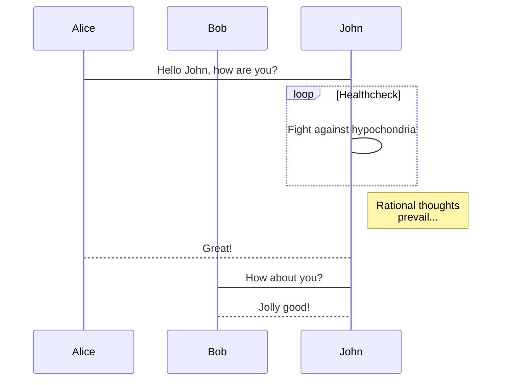
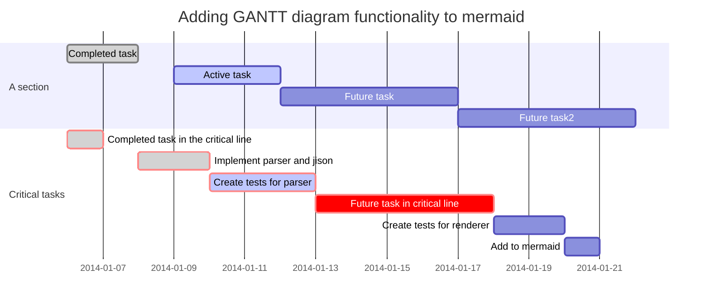

# Introduce Mermaid diagram
https://mermaidjs.github.io/

### Install mermaid
```
$ npm i -g mermaid.cli
```

### Setting up mermaid in book.json
```
{
    "plugins": ["mermaid-flow"]
}
```

### An example of a flowchart


### An example of a sequence diagram



### An example of a gantt diagram


